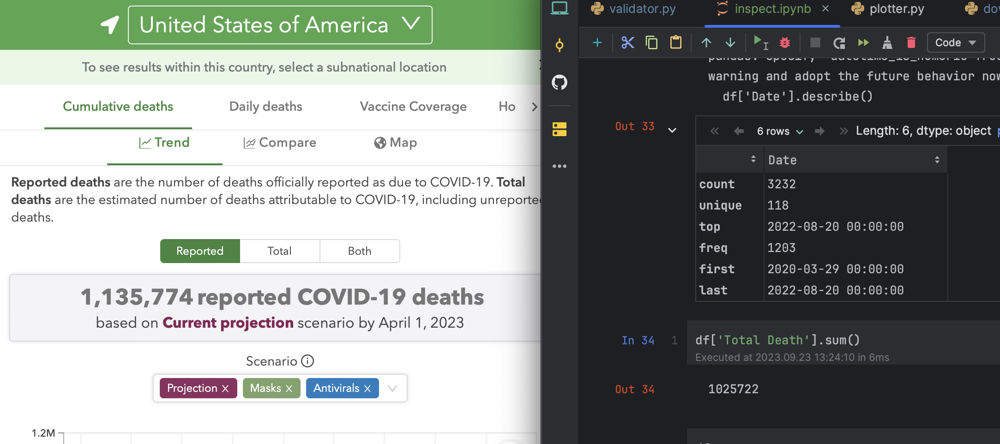

# Frequently Asked Questions (FAQ)

<b>FAQ: How do we ensure the accuracy and cleanliness of our data?</b>

## Ensuring Data Accuracy and Cleanliness

To maintain the utmost accuracy and cleanliness of our data, we have implemented a meticulous process that encompasses
the following key steps:

### Data Cleaning Process

Our data cleaning process places a strong emphasis on two critical aspects:

1. **Chronological Order**: To ensure data consistency, we meticulously arrange the dataset in chronological order based
   on date. This chronological alignment is essential for facilitating meaningful analyses and data visualizations.

2. **Data Completeness**: Rigorous validation procedures are implemented to verify the dataset's completeness and
   integrity. Any instances of missing data or inaccuracies are diligently rectified through cross-referencing with
   trusted sources.

### Validation with External Data

To affirm the accuracy and cleanliness of our dataset, we perform rigorous validation by comparing it with data from
the "Reported Covid-19" dataset available
at [https://www.healthdata.org](https://covid19.healthdata.org/united-states-of-america?view=cumulative-deaths&tab=trend).
This particular dataset is meticulously curated by the Institute for Health Metrics and Evaluation (IHME) at the
University of Washington and is widely regarded as one of the most reliable sources for COVID-19 data.

### Data Validation Result

As demonstrated in the comparison below, the left side showcases data
from [https://www.healthdata.org](https://covid19.healthdata.org/united-states-of-america?view=cumulative-deaths&tab=trend),
while the right side represents our meticulously processed data:

The striking alignment between our dataset and the data
from [https://www.healthdata.org](https://covid19.healthdata.org/united-states-of-america?view=cumulative-deaths&tab=trend)
serves as compelling evidence of the high level of accuracy and cleanliness we have achieved. We proudly assert that our
data has undergone thorough cleaning and validation, instilling confidence in its reliability.

